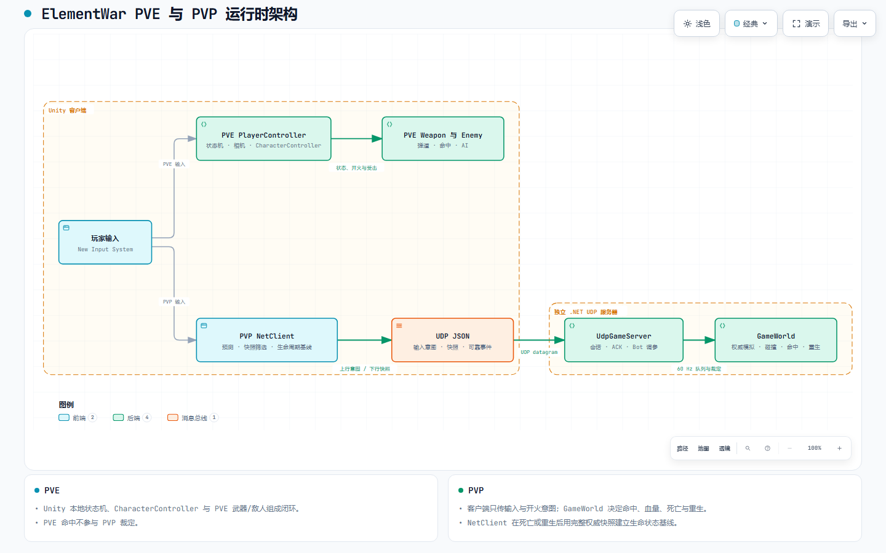
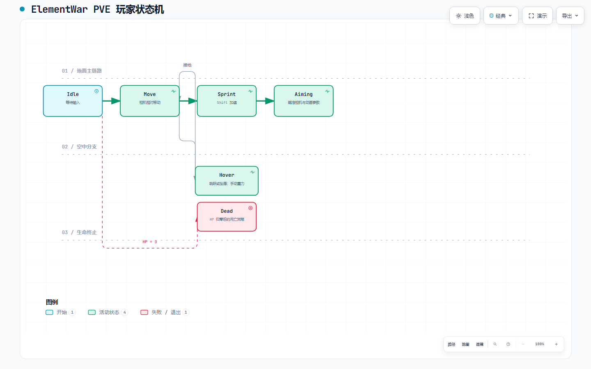
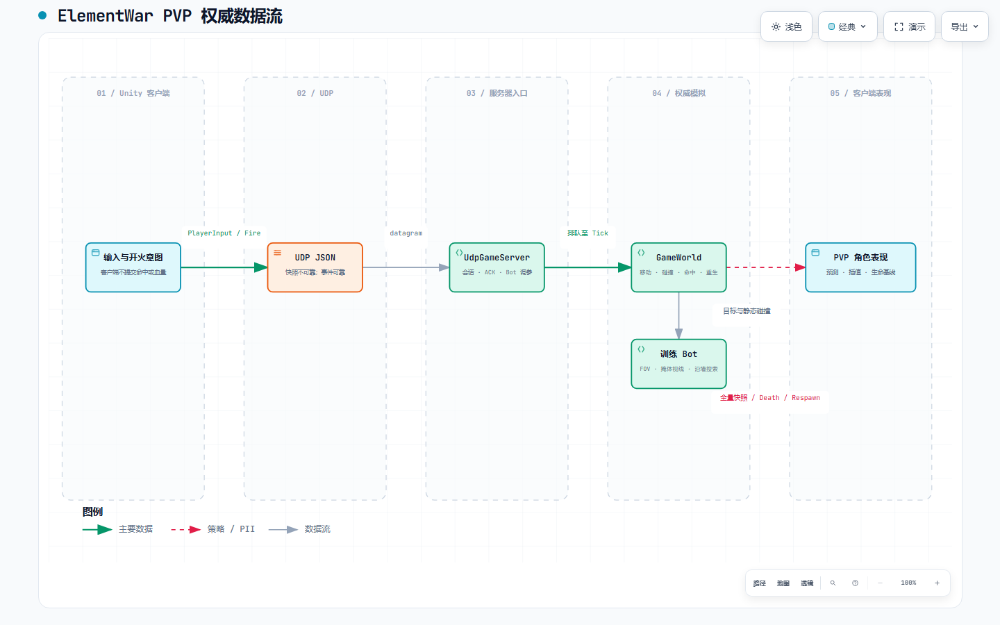

# ElementWar

ElementWar 是一个基于 Unity 2022.3 的 TPS/FPS 项目，围绕角色控制、相机与瞄准、PVE 战斗、权威 UDP PVP 和数据驱动规则展开。

## 项目结构

```text
ElementWar/
├─ Assets/
│  ├─ Scripts/
│  │  ├─ Base/          # 基础类、状态机宿主、单例
│  │  ├─ Player/        # 玩家控制、角色模型、玩家状态
│  │  ├─ Enemy/         # 敌人基类、AI 状态、攻击流程
│  │  ├─ Gameplay/      # 战斗核心与共享规则
│  │  ├─ Network/       # PVP 客户端、预测、插值、网络 UI
│  │  ├─ FPS/           # FPS/3C 实验代码
│  │  ├─ Editor/        # Unity 编辑器工具
│  │  ├─ Diagnostics/   # 运行时诊断与指标
│  │  └─ Utils/         # 通用工具
│  ├─ Settings/         # 输入与 URP 配置
│  └─ StreamingAssets/  # 运行时规则配置
├─ Server/              # 独立 .NET UDP 权威服务器
├─ Packages/            # Unity Package Manager 依赖
├─ ProjectSettings/     # Unity 项目配置
└─ Tools/               # 开发辅助工具
```

## 主要框架

| 框架 | 作用 |
|---|---|
| Unity Input System | 采集移动、跳跃、冲刺、瞄准、滑铲和开火输入 |
| Player / StateMachine | 管理角色运行数据、状态切换和角色表现 |
| Cinemachine | 管理第三人称相机、瞄准相机和相机切换 |
| Animation Rigging | 提供瞄准时的手部、身体和目标约束 |
| AI Navigation | 提供敌人追击和非主控角色跟随 |
| PVE Combat | 处理武器、子弹、命中、生命和死亡 |
| UDP PVP | 处理客户端预测、服务器权威模拟和远端插值 |
| GameRules | 为 Unity 客户端和服务器提供共享规则、校验和哈希 |

## 总体技术链路

```text
Unity Input System
        │
        ▼
PlayerController
  输入 / 相机 / 瞄准 / 角色切换
        │
        ▼
PlayerModel + StateMachine
        │
        ├─ PVE：CharacterController / NavMeshAgent / Animator
        └─ PVP：PvPMotor / NetClient / RemoteAvatar

PVE：PlayerWeapon → Bullet → EnemyBase → Health / Death

PVP：NetClient → UDP → UdpGameServer
                         │
                         ▼
                  GameWorld → Snapshot / Event
```

## 可视化架构图

以下为 GitHub 可直接预览的静态图；交互版保留主题切换、缩放和链路追踪，需下载 HTML 后在浏览器中打开。图表由 [Archify](https://github.com/tt-a1i/archify) 生成，署名与许可说明见 [THIRD_PARTY_NOTICES.md](THIRD_PARTY_NOTICES.md)。

### PVE 与 PVP 运行时总览

[打开交互版](Docs/Architecture/ElementWar-Architecture.html)



### PVE 玩家状态机

[打开交互版](Docs/Architecture/ElementWar-PVE-Player-Lifecycle.html)



### PVP 权威数据流

[打开交互版](Docs/Architecture/ElementWar-PVP-Dataflow.html)



## PVE 实现过程

### 角色控制

```text
Input System
  → PlayerController 读取输入
  → Player 状态判断动作
  → PlayerModel 写入移动状态
  → CharacterController.Move
  → Animator / Camera / IK 表现
```

`PlayerController` 负责输入、相机和角色切换；`PlayerModel` 持有角色组件和状态机；状态类负责待机、移动、冲刺、跳跃、滑铲和瞄准之间的切换。

主控角色使用代码驱动位移，非主控角色使用 `NavMeshAgent` 跟随。两条位移路径分开，避免 `CharacterController` 和 `NavMeshAgent` 同时修改同一个角色的位置。

### 战斗闭环

```text
PlayerWeapon.Fire
  → PlayerWeaponBullet
  → 飞行与碰撞检测
  → EnemyBase.Hurt
  → 生命值 / 血条
  → Enemy StateMachine
  → Dead
```

敌人由 `EnemyBase` 提供通用能力，具体敌人负责状态分发。敌人状态按照 `Idle → Move → Attack → Dead` 运行。子弹、枪口特效和命中特效使用对象池，减少战斗过程中的重复创建和销毁。

## PVP 实现过程

PVP 使用独立 .NET UDP 服务器。客户端发送输入和开火意图，服务器推进权威世界并返回快照。

```text
客户端输入
  → NetClient 编码发送
  → UdpGameServer 接收与校验
  → GameWorld 权威模拟
  → 命中 / 生命 / 死亡 / 重生 / 计分
  → SnapshotBuilder 生成快照
  → 客户端预测校正 / 远端插值
```

客户端主要模块：

- `PvPMotor`：按照与服务器一致的简化数学进行本地预测。
- `NetClient`：处理连接、输入、快照、规则校验和网络事件。
- `RemoteAvatar`：缓存远端快照并进行插值。

服务器主要模块：

- `GameWorld`：权威移动、命中、生命、死亡和计分。
- `UdpGameServer`：连接、输入接收和快照发送。
- `ClientReplicator`：按客户端组装同步数据。
- `ReliableEventLedger`：管理死亡、重生、击杀和结算等可靠事件。

PVE 的 Unity 状态机和 `CharacterController` 不作为服务器逻辑。PVP 客户端使用 `PvPMotor`，服务器使用 `GameWorld`，两端通过共享规则和简化数学保持一致。

## 规则与配置

规则文件：`Assets/StreamingAssets/Rules/GameRules.v1.json`

```text
读取 JSON
  → GameRulesContracts 反序列化
  → GameRulesValidator 校验
  → GameRulesHash 计算内容哈希
  → 注入客户端 / 服务器运行时
```

Unity 客户端使用 `GameRulesRuntimeLoader`，服务器使用 `GameRulesFileLoader`。规则版本或内容哈希不一致时，PVP 连接不会进入同步流程。

## 运行方式

使用 Unity Hub 打开项目根目录，并使用 Unity `2022.3.62f3`。

服务器在 `Server/` 目录运行：

```powershell
dotnet build
dotnet run --self-test
dotnet run
```

服务器默认监听 UDP `7777`。PVP 测试时先启动服务器，再启动 Unity 客户端。

## 公开内容边界

公开仓库主要提供代码、服务器、配置和技术链路说明。第三方模型、动画、音频、贴图、Prefab、场景和框架源码不随仓库重新分发。

## 开源技术致谢与许可

本项目在架构设计和工程实践中参考了以下开源项目；每项的使用边界、作者、原始地址和许可证说明均见 [THIRD_PARTY_NOTICES.md](THIRD_PARTY_NOTICES.md)。这不是对原项目源码、资源或商标的再授权，也不代表原作者认可或参与本项目。

- [Archify](https://github.com/tt-a1i/archify) — 作者 `tt-a1i`；本仓库的交互式架构图由其工具生成，遵循其 MIT 许可的署名要求。
- [BBB-Nexus](https://github.com/bunkerboy258/BBB-Nexus) — 作者 `bunkerboy258`；借鉴意图、黑板、分层状态与表现驱动解耦思路，不重新分发其框架源码。
- [YokiFrame](https://github.com/HinataYoki/YokiFrame) — 作者 `HinataYoki`；借鉴分层、事件、状态机、对象池与模块边界思路，不重新分发其框架源码。
- [Fantasy](https://github.com/qq362946/Fantasy) — 作者 `qq362946`；借鉴协议、会话与服务端边界设计，不重新分发其框架源码；请同时遵守其上游许可证中的附加限制。

## 协作

项目整理与公开版本收口由项目作者与 OpenAI Codex 协作完成。
